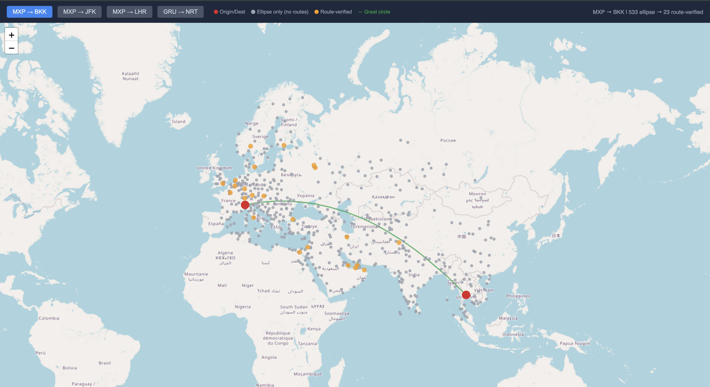

# SCALO


Quando voli da Milano a Bangkok, la compagnia aerea potrebbe chiederti €1.176 per un volo diretto. Ma c'è qualcosa che molti viaggiatori non sanno: a volte è possibile comprare due biglietti separati — Milano-Istanbul e poi Istanbul-Bangkok — e pagare molto meno. In questo caso €629 invece di €1.176, con un risparmio di €547. E in più hai uno scalo a Istanbul dove puoi fermarti qualche giorno prima di proseguire.

Questa è l'idea di SCALO. Uno strumento che fa questa ricerca in automatico.

Fornisci origine, destinazione e date di viaggio. Ci sono due modalità:

1. **Hai già una città in mente** — "Voglio fermarmi a Istanbul sulla strada per Bangkok." SCALO calcola il costo dei tre voli separati (andata tratta 1, andata tratta 2, ritorno), il prezzo del volo diretto e il risparmio.
2. **Non sai dove fermarti** — SCALO seleziona automaticamente gli aeroporti candidati lungo la tua rotta usando un filtro geometrico basato sull'ellisse (metodo Haversine).


Il motore è completo e funzionante. L'interfaccia web è completa.

## Struttura del Progetto

```
backend/           Server Express (API REST)
  adapters/        Wrapper per provider di dati di volo (serpapi, mock_fake, mock_real, mock_discover, mock_demo)
  services/        Logica di business (flights.js, hubs.js)
  routes/          Endpoint HTTP
  tests/           Suite di test Vitest
client/            Interfaccia web (Vite + React + Tailwind)
  src/             Componenti React e stili
  src/tests/       Suite di test Vitest + React Testing Library
scripts/           Script CLI per fetching campioni API reali
dataset/           Dati OpenFlights — airports.csv, airlines.dat, routes.dat
doc/
  samples/         Dati SerpAPI salvati — leg_* usati da mock_real, search_* e discover_* per riferimento
  screenshots/     Screenshot dell'interfaccia
  rapporto.tex     Relazione di progetto
```

## Setup

**Requisiti:** Node.js 18+

Ogni cartella ha le proprie dipendenze. Va eseguito `npm install` almeno una volta in ciascuna prima di poterla usare.

Per il server:

```bash
cd backend && npm install
```

Per il client:

```bash
cd client && npm install
```

Per gli script esplorativi (solo se necessario):

```bash
cd scripts && npm install
```

Crea il file `backend/.env` e inserisci:

```
SERPAPI_KEY=la_tua_chiave_serpapi
FLIGHT_PROVIDER=mock_real
PORT=3001
```

Avvia backend e frontend in due terminali separati:

```bash
# Terminale 1 — backend
cd backend
npm run dev    # sviluppo — riavvio automatico ad ogni modifica

# Terminale 2 — frontend
cd client
npm run dev    # avvia Vite su http://localhost:5173
```

Il client in sviluppo fa proxy automatico delle richieste `/api/*` verso il backend sulla porta 3001.

Verifica che il backend sia attivo:

```bash
curl http://localhost:3001/health
# { "status": "ok", "provider": "mock", "timestamp": "..." }
```

## Usare il Form di Ricerca

Apri `http://localhost:5173` nel browser. Il form ha due modalità selezionabili tramite il toggle **Discover best stopover**:

- **Modalità Search** (toggle off): specifica uno scalo preciso. Campi disponibili: Origin, Stopover, Destination, Departure Date, Nights at stopover, Return Date.
- **Modalità Discover** (toggle on): SCALO calcola gli scali candidati lungo la rotta e li mostra su una mappa interattiva. I punti arancioni sono hub con rotte verificate — clicca su uno per avviare la ricerca su quel corridoio.

| Campo | Descrizione |
|-------|-------------|
| **Origin** | Codice IATA dell'aeroporto di partenza (es. MXP) |
| **Stopover** | Codice IATA della città dove vuoi fermarti (es. IST) — solo in modalità Search |
| **Destination** | Codice IATA della destinazione finale (es. BKK) |
| **Departure Date** | Quando parti dalla città di origine |
| **Nights at stopover** | Quante notti vuoi fermarti allo scalo (default: 3) |
| **Return Date** | Quando torni dalla destinazione alla città di origine (opzionale) |

## Comportamento con Risultati Vuoti

L'interfaccia gestisce tre scenari quando una ricerca non produce risultati utili:

| Scenario | Cosa succede | Messaggio |
|----------|-------------|-----------|
| **Nessun volo trovato** | Uno o più tratti non hanno opzioni di volo | Indica quali tratte specifiche non hanno risultati e suggerisce di cambiare date o scalo |
| **Nessun volo diretto** | I voli con scalo sono stati trovati ma non esiste un volo diretto per confrontare il risparmio | Informa che il calcolo del risparmio non è disponibile, con opzione di vedere comunque i voli |
| **Scalo più costoso** | Lo scalo costa più del volo diretto | Mostra la differenza di prezzo e permette di visualizzare comunque i dettagli |

In tutti i casi l'utente può fare una nuova ricerca senza ricaricare la pagina.

## Provider di Dati di Volo

Il backend supporta quattro provider, selezionabili tramite `FLIGHT_PROVIDER` in `backend/.env`:

| Valore | Descrizione |
|--------|-------------|
| `mock_real` | Risposte reali SerpAPI salvate in `doc/samples/` — default per sviluppo |
| `mock_fake` | Dati inventati per testare casi limite (stopover caro, nessun volo diretto, ranking) |
| `mock_demo` | Dati reali per quattro corridoi demo: FCO→AMS, CDG→BKK, LHR→SIN, GRU→NRT |
| `mock_discover` | Dati reali da `doc/samples/discover_MXP_BKK_2026-03-19.json` — 16 hub per MXP→BKK |
| `serpapi` | SerpApi Google Flights live — solo per demo e deploy |

## Variabili d'Ambiente

Tutte le variabili vanno in `backend/.env`:

| Variabile | Descrizione |
|-----------|-------------|
| `SERPAPI_KEY` | Chiave API SerpAPI — necessaria solo con `FLIGHT_PROVIDER=serpapi` |
| `FLIGHT_PROVIDER` | Provider dati di volo (vedi tabella sopra) — default `mock_real` |
| `PORT` | Porta del server backend — default `3001` |
| `SAVE_SAMPLES` | Se `true`, ogni risposta SerpAPI viene salvata in `doc/samples/` — utile per catturare nuovi dati reali senza script separati |

## Eseguire i Test

Dalla root del progetto (backend + frontend insieme):

```bash
npm test
```

Oppure da `backend/` o `client/` separatamente. Per watch mode: `npm run test:watch`.

**Backend** (`backend/tests/`):
- `flights.fake.test.js` — logica del servizio con dati controllati: stopover economico, costoso, nessun volo diretto, ordinamento per risparmio
- `flights.real.test.js` — verifica che il servizio calcoli correttamente prezzi e risparmio sui campioni reali SerpAPI, usando un percorso di codice indipendente dal servizio stesso

**Frontend** (`client/src/tests/`):
- `SearchForm.test.jsx` — toggle search/discover, visibilità del campo Stopover, parametri corretti passati all'handler
- `App.test.jsx` — i tre scenari di risposta vuota (nessun volo, nessun diretto, scalo più costoso) con fetch mockato


## Selezione Dinamica degli Hub



In modalità Discover, il sistema seleziona gli aeroporti candidati per lo scalo attraverso un pipeline a 2 livelli, senza consumare chiamate API:

| Livello | Cosa fa | Input → Output |
|---------|---------|----------------|
| **1. Ellipse** | Filtro geografico Haversine: `d(A,C) + d(C,B) <= (1 + f) * d(A,B)` con f=0.2 | ~1168 → ~100-400 |
| **2. Route filter** | Verifica esistenza rotte A→S e S→B tramite OpenFlights (solo compagnie attive) | ~100-400 → ~20-80 |

**Come funziona:**

1. Calcola la distanza geodetica (Haversine) tra A e B
2. Definisce un budget massimo di distanza: `d_max = (1 + f) * d(A,B)`, dove `f` è il fattore di tolleranza (default 20%)
3. Per ogni aeroporto `large_airport` nel dataset OurAirports (~1168 aeroporti con servizio schedulato), verifica se `d(A,C) + d(C,B) <= d_max`
4. Filtra ulteriormente verificando che esistano rotte reali A→S e S→B nel dataset OpenFlights, considerando solo compagnie aeree attive

Questo approccio garantisce che gli scali proposti siano geograficamente sensati e abbiano connessioni aeree reali, evitando di interrogare aeroporti irrilevanti.

Se le coordinate di partenza o arrivo non vengono trovate nel dataset, il sistema usa una lista di fallback con 16 hub principali mondiali.


## Licenze e Attribuzioni

Dati aeroportuali da OurAirports — pubblico dominio.
Dati rotte e compagnie aeree da OpenFlights — disponibili sotto Open Database License (ODbL).