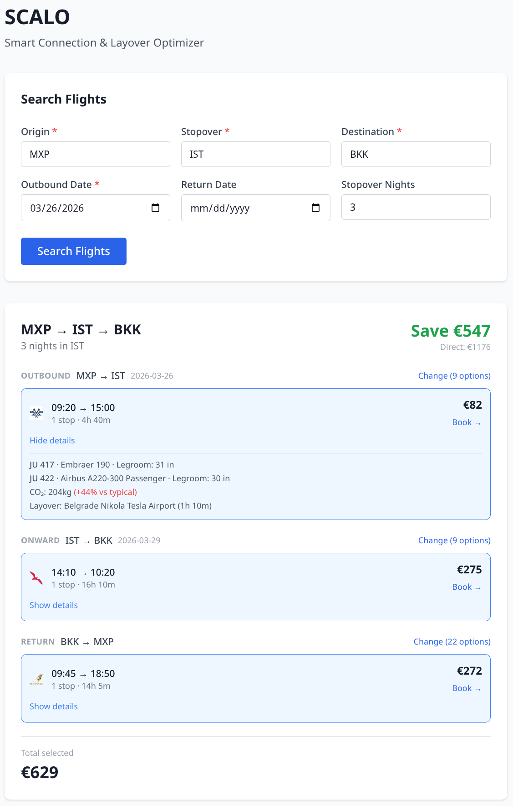

# SCALO

Quando voli da Milano a Bangkok, la compagnia aerea potrebbe chiederti €1.176 per un volo diretto. Ma c'è qualcosa che molti viaggiatori non sanno: a volte è possibile comprare due biglietti separati Milano-Istanbul e poi Istanbul-Bangkok pagando molto meno. In questo caso €629 invece di €1.176, con un risparmio di €547. E in più hai uno scalo a Istanbul dove puoi fermarti qualche giorno prima di proseguire.

Questa è l'idea di SCALO. Uno strumento che fa questa ricerca in automatico.

Fornisci origine, destinazione e date di viaggio. Ci sono due modalità:

1. **Hai già una città in mente**: "Voglio fermarmi a Istanbul sulla strada per Bangkok." SCALO calcola il costo dei tre voli separati (andata tratta 1, andata tratta 2, ritorno), il prezzo del volo diretto e il risparmio.
2. **Non sai dove fermarti**: SCALO controlla automaticamente 16 grandi hub aeroportuali nel mondo (Istanbul, Dubai, Doha, Londra, Singapore, ecc.) e restituisce una classifica ordinata per risparmio. L'offerta migliore è in cima.

Il motore è completo e funzionante. L'interfaccia web permette già di effettuare ricerche e visualizzare i risultati: form di ricerca, card con opzioni di volo selezionabili per ogni tratta, calcolo del risparmio in tempo reale e link diretto a Skyscanner per prenotare ciascun volo.



## Struttura del Progetto

```
backend/           Server Express (API REST)
  adapters/        Wrapper per provider di dati di volo (serpapi, mock_fake, mock_real)
  services/        Logica di business (flights.js)
  routes/          Endpoint HTTP
  tests/           Suite di test Vitest
client/            Interfaccia web (Vite + React + Tailwind)
  src/             Componenti React e stili
scripts/           Script CLI per fetching campioni API reali
doc/
  api_samples/     Risposte reali SerpAPI usate da mock_real
  responses/       Risposte complete degli endpoint salvate per riferimento
    search/        Risposte reali di /api/search testate via interfaccia web (FCO→IST→BKK, LHR→JFK→LAX)
```

## Setup

**Requisiti:** Node.js 18+

Ogni cartella ha le proprie dipendenze. Va eseguito `npm install` almeno una volta in ciascuna prima di poterla usare.

Per il server:

```bash
cd backend && npm install
```

Per il client:

```bash
cd client && npm install
```

Per gli script esplorativi (solo se necessario):

```bash
cd scripts && npm install
```

Copia il file di esempio e inserisci la tua chiave SerpAPI:

```bash
cp backend/.env.example backend/.env
```

Il file `backend/.env` contiene:

```
SERPAPI_KEY=la_tua_chiave_serpapi
FLIGHT_PROVIDER=mock_real
PORT=3001
```

Avvia backend e frontend in due terminali separati:

```bash
# Terminale 1 — backend
cd backend
npm run dev    # sviluppo — riavvio automatico ad ogni modifica

# Terminale 2 — frontend
cd client
npm run dev    # avvia Vite su http://localhost:5173
```

Il client in sviluppo fa proxy automatico delle richieste `/api/*` verso il backend sulla porta 3001.

Verifica che il backend sia attivo:

```bash
curl http://localhost:3001/health
# { "status": "ok", "provider": "mock", "timestamp": "..." }
```

## Provider di Dati di Volo

Il backend supporta tre provider, selezionabili tramite `FLIGHT_PROVIDER` in `backend/.env`:

| Valore | Descrizione |
|--------|-------------|
| `mock_real` | Risposte reali SerpAPI salvate in `doc/api_samples/`: default per sviluppo |
| `mock_fake` | Dati inventati per testare casi limite (stopover caro, nessun volo diretto, ranking) |
| `serpapi` | SerpApi Google Flights live solo per demo e deploy |

## Aggiornare i Dati di Mock Reali

I file in `doc/api_samples/` sono risposte reali SerpAPI catturate in un momento specifico.
Per aggiornarli con prezzi freschi (richiede una `SERPAPI_KEY` valida in `scripts/.env`):

```bash
cd scripts && npm install
node fetch_leg_responses.js
```

Questo sovrascrive i 4 file in `doc/api_samples/` con nuove risposte live per i percorsi:
- MXP → IST (solo andata)
- IST → BKK (solo andata)
- BKK → MXP (solo andata)
- MXP → BKK (andata e ritorno baseline volo diretto)

## Aggiungere Nuovi Aeroporti ai Campioni

Per aggiungere una nuova rotta ai dati reali (es. MXP → DXB come scalo):

**1.** In `scripts/fetch_leg_responses.js`, aggiungi una voce all'array `LEGS`:

```js
{ key: "MXP_DXB_oneway", departure_id: "MXP", arrival_id: "DXB", outbound_date: "2026-06-10", type: "2" },
```

I campi modificabili sono:

| Campo | Descrizione |
|-------|-------------|
| `key` | Nome identificativo e diventa il nome del file (`leg_<key>.json`) |
| `departure_id` | Codice IATA dell'aeroporto di partenza |
| `arrival_id` | Codice IATA dell'aeroporto di arrivo |
| `outbound_date` | Data di partenza in formato `YYYY-MM-DD` |
| `return_date` | Data di ritorno solo per andata e ritorno (`type: "1"`), omettere per solo andata |
| `type` | `"2"` = solo andata, `"1"` = andata e ritorno |

**2.** Riesegui lo script per scaricare il nuovo file:

```bash
cd scripts && node fetch_leg_responses.js
```

**3.** In `backend/adapters/mock_real.js`, aggiungi una riga al map `ROUTES`:

```js
"MXP→DXB:2": JSON.parse(readFileSync(join(samplesDir, "leg_MXP_DXB_oneway.json"), "utf8")),
```

Il tipo va specificato come `:1` per andata e ritorno, `:2` per solo andata.

## Testare gli Endpoint HTTP

Con il server avviato (`npm run dev` da `backend/`), è possibile testare gli endpoint con `curl`.

**POST /api/search**: cerca i voli con uno scalo specifico:

```bash
curl -s -X POST http://localhost:3001/api/search -H "Content-Type: application/json" -d '{"origin":"MXP","destination":"BKK","stopover":"IST","outboundDate":"2026-06-10","returnDate":"2026-06-20","stopoverNights":3}'
```

La risposta include i tre legs (andata tratta 1, andata tratta 2, ritorno) con il prezzo migliore per ciascuno, più un summary con `bestCombinedPrice`, `directPrice` e `savings`.

**POST /api/discover**: trova automaticamente lo scalo più conveniente tra tutti i 16 hub city:

```bash
curl -s -X POST http://localhost:3001/api/discover -H "Content-Type: application/json" -d '{"origin":"MXP","destination":"BKK","outboundDate":"2026-06-10","returnDate":"2026-06-20","stopoverNights":3}'
```

Non si specifica lo scalo, il servizio li prova tutti e restituisce un array ordinato per risparmio decrescente. Il primo elemento è lo scalo più conveniente.

Per salvare la risposta in un file (utile con `FLIGHT_PROVIDER=serpapi` per non consumare quota inutilmente):

```bash
curl -s -X POST http://localhost:3001/api/discover -H "Content-Type: application/json" -d '{"origin":"MXP","destination":"BKK","outboundDate":"2026-06-10","returnDate":"2026-06-20","stopoverNights":3}' | tee ../doc/responses/discover_MXP_BKK_$(date +%Y-%m-%d).json
```

In caso di parametri mancanti o non validi il server risponde con HTTP 400 e un messaggio esplicativo. In caso di quota API esaurita risponde con HTTP 429.

## Usare la API Live

Per chiamate reali a Google Flights tramite SerpAPI, imposta in `backend/.env`:

```
SERPAPI_KEY=la_tua_chiave
FLIGHT_PROVIDER=serpapi
```

Riavvia il server. Tieni presente che `/api/discover` effettua 64 chiamate API in una sola richiesta (16 hub × 4 legs ciascuno): salvare sempre la risposta su file per evitare di consumare quota inutilmente.

### Test minimo via interfaccia web (3 chiamate API)

Il modo più economico per verificare che la chiave funzioni e che la pipeline sia integra end-to-end è usare direttamente il frontend:

1. Imposta `FLIGHT_PROVIDER=serpapi` in `backend/.env`
2. Avvia backend e frontend
3. Apri `http://localhost:5173` e cerca un volo (es. FCO → IST → BKK)
4. Una singola ricerca effettua esattamente 3 chiamate API (tratta 1, tratta 2, volo diretto di confronto)
5. Se la card con i risultati appare con prezzi reali, tutto funziona
6. Rimetti `FLIGHT_PROVIDER=mock_real` al termine del test

Le risposte ottenute durante questi test sono salvate in `doc/responses/search/` come riferimento.

## Eseguire i Test

I test usano Vitest e si eseguono con un solo comando da `backend/`:

```bash
cd backend && npm test
```

Non è necessario modificare `FLIGHT_PROVIDER` in `.env`. Vitest imposta il provider corretto per ciascun file automaticamente tramite `vitest.config.js`.

**flights.fake.test.js**: verifica la logica del servizio con dati inventati e controllati (stopover economico, stopover costoso, nessun volo diretto, ordinamento per risparmio).

**flights.real.test.js**: verifica che il servizio elabori correttamente i dati reali catturati. Questo test legge i JSON grezzi in modo indipendente dal servizio: se il servizio ha un bug nel calcolo, i due percorsi di codice non coincidono.

Per sviluppo con riavvio automatico ad ogni modifica:

```bash
npm run test:watch
```
