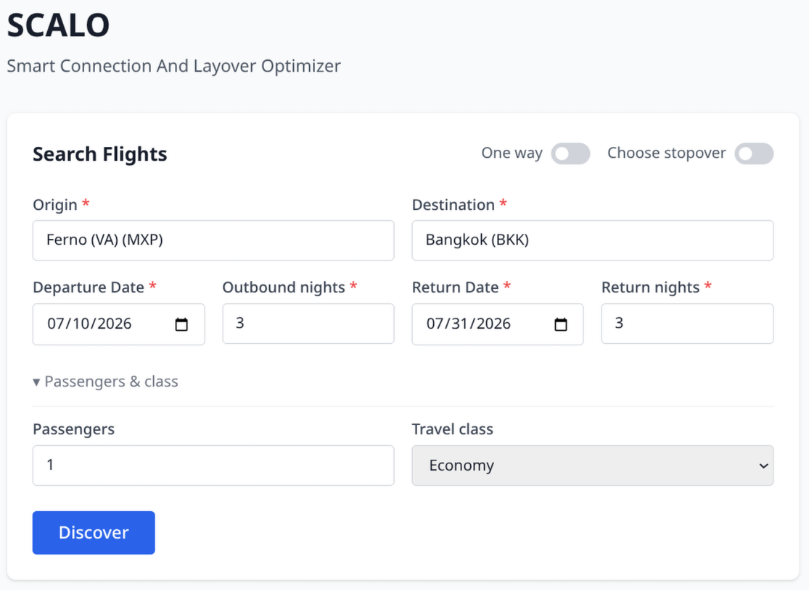
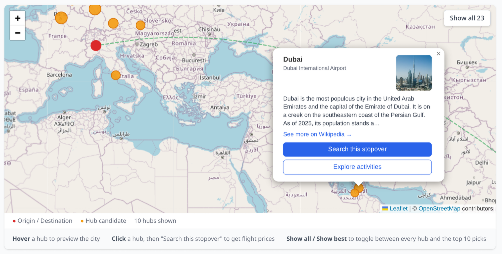
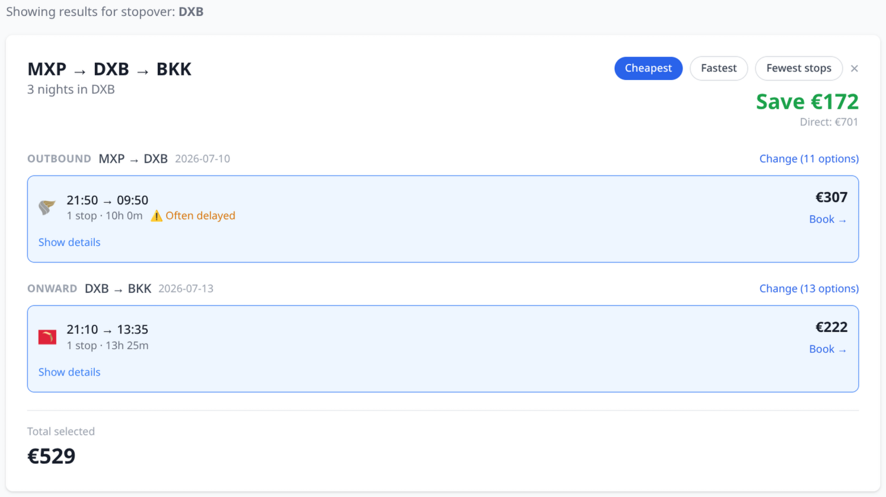
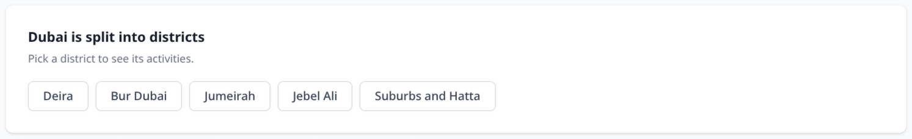
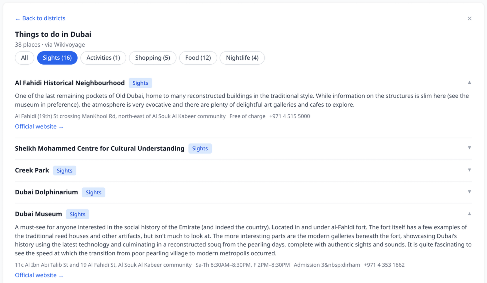

# SCALO



A volte è possibile comprare due biglietti separati — Milano-Istanbul e poi Istanbul-Bangkok — e pagare molto meno del volo diretto. E in più hai uno scalo a Istanbul dove puoi fermarti qualche giorno prima di proseguire.

Questa è l'idea di SCALO. Uno strumento che fa questa ricerca in automatico.

Fornisci origine, destinazione e date di viaggio. Ci sono due modalità:

1. **Hai già una città in mente** — "Voglio fermarmi a Istanbul sulla strada per Bangkok." SCALO calcola il costo dei tre voli separati (andata tratta 1, andata tratta 2, ritorno), il prezzo del volo diretto e il risparmio.
2. **Non sai dove fermarti** — SCALO seleziona automaticamente gli aeroporti candidati lungo la tua rotta usando un filtro geometrico basato sull'ellisse (metodo Haversine).


Il motore è completo e funzionante. L'interfaccia web è completa.

## Struttura del Progetto

```
backend/           Server Express (API REST)
  adapters/        Wrapper per provider di dati (serpapi, mock_fake, mock_real, wikivoyage, gyg)
  services/        Logica di business (flights.js, hubs.js, activities.js)
  routes/          Endpoint HTTP (search, hubs, activities)
  tests/           Suite di test Vitest
client/            Interfaccia web (Vite + React + Tailwind)
  src/             Componenti React e stili
  src/tests/       Suite di test Vitest + React Testing Library
scripts/           Script CLI per fetching campioni API reali
dataset/           Dati OpenFlights — airports.csv, airlines.dat, routes.dat
doc/
  samples/         Dati SerpAPI salvati — leg_* usati da mock_real per sviluppo offline; gyg/ usati dall'adapter GYG
  screenshots/     Screenshot dell'interfaccia
  rapporto.tex     Relazione di progetto
```

## Setup

**Requisiti:** Node.js 18+

Ogni cartella ha le proprie dipendenze. Va eseguito `npm install` almeno una volta in ciascuna prima di poterla usare.

Per il server:

```bash
cd backend && npm install
```

Per il client:

```bash
cd client && npm install
```

Per gli script esplorativi (solo se necessario):

```bash
cd scripts && npm install
```

Crea il file `backend/.env` e inserisci:

```
SERPAPI_KEY=la_tua_chiave_serpapi
FLIGHT_PROVIDER=serpapi
PORT=3001
```

Avvia backend e frontend in due terminali separati:

```bash
# Terminale 1 — backend
cd backend
npm run dev    # sviluppo — riavvio automatico ad ogni modifica

# Terminale 2 — frontend
cd client
npm run dev    # avvia Vite su http://localhost:5173
```

Il client in sviluppo fa proxy automatico delle richieste `/api/*` verso il backend sulla porta 3001.


## Usare il Form di Ricerca

Apri `http://localhost:5173` nel browser. Il form ha due modalità selezionabili tramite il toggle **Choose stopover**:

- **Modalità Discover** (toggle off, default): SCALO calcola gli scali candidati lungo la rotta, li punteggia e li mostra su una mappa interattiva. Passa il cursore su un hub per vedere un'anteprima della città con snippet Wikipedia. Clicca su un hub per aprire il popup con foto e dettagli, poi premi **"Search this stopover"** per avviare la ricerca su quel corridoio oppure **"Explore activities"** per vedere cosa fare nella città. I pulsanti **Show all / Show best** (in alto a destra sulla mappa) alternano tra tutti gli hub nell'ellisse e i top 10 selezionati automaticamente.



- **Modalità Search** (toggle on): specifica uno scalo preciso. Campi disponibili: Origin, Stopover, Destination, Departure Date, Outbound nights, Return Date, Return nights.

| Campo | Descrizione |
|-------|-------------|
| **Origin** | Cerca per nome citta, nome aeroporto, codice IATA o paese (es. "Milano", "Malpensa", "MXP", "IT") |
| **Stopover** | Stessa ricerca — solo in modalità Search |
| **Destination** | Stessa ricerca |
| **Departure Date** | Quando parti dalla citta di origine |
| **Outbound nights** | Quante notti vuoi fermarti allo scalo di andata (default: 3) |
| **Return Date** | Quando torni dalla destinazione alla citta di origine |
| **Return nights** | Quante notti vuoi fermarti allo scalo di ritorno (default: 3) |

I campi Origin, Stopover e Destination supportano l'autocompletamento: digitando almeno 2 caratteri appare una lista di suggerimenti con citta, aeroporto e codice IATA. Si puo anche digitare direttamente un codice IATA a 3 lettere.

La sezione **Passengers & class** (espandibile) permette di impostare il numero di passeggeri e la classe di viaggio.


## Comportamento con Risultati Vuoti

L'interfaccia gestisce tre scenari quando una ricerca non produce risultati utili:

| Scenario | Cosa succede | Messaggio |
|----------|-------------|-----------|
| **Nessun volo trovato** | Uno o più tratti non hanno opzioni di volo | Indica quali tratte specifiche non hanno risultati e suggerisce di cambiare date o scalo |
| **Nessun volo diretto** | I voli con scalo sono stati trovati ma non esiste un volo diretto per confrontare il risparmio | Informa che il calcolo del risparmio non è disponibile, con opzione di vedere comunque i voli |
| **Scalo più costoso** | Lo scalo costa più del volo diretto | Mostra la differenza di prezzo rispetto al diretto e permette di visualizzare comunque i voli. Propone anche di esplorare le attività nella città di scalo — potrebbe valere il costo extra |

In tutti i casi l'utente può fare una nuova ricerca senza ricaricare la pagina.

Quando una ricerca va a buon fine, i risultati vengono mostrati in una scheda con i tratti di volo, ordinabili per prezzo, durata o numero di scali.



## Provider di Dati di Volo

Il backend supporta tre provider, selezionabili tramite `FLIGHT_PROVIDER` in `backend/.env`:

| Valore | Descrizione |
|--------|-------------|
| `serpapi` | SerpAPI Google Flights live — provider principale |
| `mock_real` | Risposte reali SerpAPI salvate in `doc/samples/` — per sviluppo offline (MXP→IST→BKK) |
| `mock_fake` | Dati inventati per testare casi limite (stopover caro, nessun volo diretto, ranking) |

## Variabili d'Ambiente

Tutte le variabili vanno in `backend/.env`:

| Variabile | Descrizione |
|-----------|-------------|
| `SERPAPI_KEY` | Chiave API SerpAPI — necessaria solo con `FLIGHT_PROVIDER=serpapi` |
| `FLIGHT_PROVIDER` | Provider dati di volo (vedi tabella sopra) — default `serpapi` |
| `ACTIVITY_PROVIDER` | `wikivoyage` (default) oppure `gyg`. Sceglie il provider per l'endpoint `/api/activities`. |
| `GYG_API_KEY` | Chiave API GetYourGuide — necessaria solo con `ACTIVITY_PROVIDER=gyg` per chiamate live. Senza chiave usa i file sample in `doc/samples/gyg/`. |
| `PORT` | Porta del server backend — default `3001` |
| `SAVE_SAMPLES` | Se `true`, ogni risposta SerpAPI viene salvata in `doc/samples/` — utile per catturare nuovi dati reali senza script separati |

## Activity Providers

SCALO supporta due provider per l'endpoint `/api/activities`, selezionabili tramite la variabile `ACTIVITY_PROVIDER`:

### `wikivoyage` (default)

Dati live da [Wikivoyage](https://en.wikivoyage.org) via API MediaWiki. Funziona per qualsiasi città del mondo, include gestione dei districts (città grandi suddivise in sotto-pagine). I dati includono: nome, descrizione, indirizzo, orari, prezzo (stringa), telefono e coordinate.

### `gyg`

Integrazione GetYourGuide Partner API. Ogni attività include campi arricchiti: rating, numero recensioni, thumbnail, durata, prezzo (con eventuale sconto), e link di prenotazione diretto su getyourguide.com.

**Con `GYG_API_KEY`**: il backend chiama `GET https://api.getyourguide.com/1/tours?q={city}` in tempo reale.

**Senza `GYG_API_KEY`**: il backend legge i file sample in `doc/samples/gyg/gyg_tours_{city}.json`. Attualmente è disponibile solo `gyg_tours_dubai.json`; per altre città il pannello mostra il fallback vuoto.

```
ACTIVITY_PROVIDER=gyg
```

Il frontend si adatta automaticamente: mostra "via GetYourGuide", categorie GYG (Skip-the-Line, Walking Tours, Food Tours, ecc.), rating con stelle, prezzi con eventuale barrato, e pulsante "Book on GetYourGuide →".


## Eseguire i Test

Dalla root del progetto (backend + frontend insieme):

```bash
npm test
```

Oppure da `backend/` o `client/` separatamente. Per watch mode: `npm run test:watch`.

**Backend** (`backend/tests/`):
- `flights.fake.test.js` — logica del servizio con dati controllati: stopover economico, costoso, nessun volo diretto, ordinamento per risparmio
- `flights.real.test.js` — verifica che il servizio calcoli correttamente prezzi e risparmio sui campioni reali SerpAPI, usando un percorso di codice indipendente dal servizio stesso

**Frontend** (`client/src/tests/`):
- `SearchForm.test.jsx` — toggle search/discover, visibilità del campo Stopover, parametri corretti passati all'handler
- `App.test.jsx` — i tre scenari di risposta vuota (nessun volo, nessun diretto, scalo più costoso) con fetch mockato


## Selezione Dinamica degli Hub

In modalità Discover, il sistema seleziona e classifica gli aeroporti candidati per lo scalo attraverso un pipeline a 3 livelli, senza consumare chiamate API:

| Livello | Cosa fa | Input → Output |
|---------|---------|----------------|
| **1. Ellipse** | Filtro geografico Haversine: `d(A,C) + d(C,B) <= (1 + f) * d(A,B)` con f=0.2 | ~1168 → ~100-400 |
| **2. Route filter** | Verifica esistenza rotte A→S e S→B tramite OpenFlights (solo compagnie attive) | ~100-400 → ~20-80 |
| **3. Scoring** | Punteggio composito per selezionare i top 10 hub — attivato con `?auto=true` | ~20-80 → 10 |

**Come funziona:**

1. Calcola la distanza geodetica (Haversine) tra A e B
2. Definisce un budget massimo di distanza: `d_max = (1 + f) * d(A,B)`, dove `f` è il fattore di tolleranza (default 20%)
3. Per ogni aeroporto `large_airport` nel dataset OurAirports (~1168 aeroporti con servizio schedulato), verifica se `d(A,C) + d(C,B) <= d_max`
4. Filtra ulteriormente verificando che esistano rotte reali A→S e S→B nel dataset OpenFlights, considerando solo compagnie aeree attive
5. Punteggia ogni hub con una formula composita: `0.3 × airlines_leg1 + 0.3 × airlines_leg2 + 0.2 × (1 - detour%) + 0.2 × total_routes` — dove `airlines_leg1/2` è il numero di compagnie che operano esattamente quel tratto

La mappa mostra di default i top 10 hub. Il pulsante **Show all** mostra tutti gli hub nell'ellisse; **Show best** ritorna ai top 10.

**Correzioni città (CITY_OVERRIDES):** il dataset OurAirports include 74 aeroporti dove il campo `municipality` indica un sobborgo o distretto invece della città servita (es. Islamabad International ha `municipality = "Attock"`). Una tabella statica in `hubs.js` corregge questi casi prima che la città venga usata per la ricerca Wikipedia.

Se le coordinate di partenza o arrivo non vengono trovate nel dataset, il sistema usa una lista di fallback con 16 hub principali mondiali.


## Attività Wikivoyage

SCALO integra le guide di viaggio di [Wikivoyage](https://en.wikivoyage.org) per mostrare cosa fare, vedere, mangiare e comprare nella città di scalo. **Non richiede nessuna chiave API** — Wikivoyage è una wiki pubblica con API gratuita.

### Come accedervi

- **Modalità Discover**: clicca su un hub sulla mappa → pulsante **"Explore activities"** nel popup
- **Risultati volo trovati**: sopra la scheda voli compare il pulsante **"Search activities in [città]"**
- **Scalo più costoso** (Scenario C): se lo scalo costa più del diretto, compare il pulsante **"Search activities"** per valutare se vale comunque la pena fermarsi

### Come funziona

Il backend chiama l'API MediaWiki di Wikivoyage (`en.wikivoyage.org/w/api.php`) e analizza il wikitext grezzo della pagina della città, estraendo i template `{{listing}}` con nome, descrizione, indirizzo, orari, prezzo e URL. I risultati vengono raggruppati per sezione:

| Sezione Wikivoyage | Categoria mostrata |
|---|---|
| See | Sights |
| Do | Activities |
| Eat | Food |
| Drink | Nightlife |
| Buy | Shopping |

### Città con distretti

Le grandi città (Istanbul, Amsterdam, Dubai) suddividono i contenuti in sotto-pagine per distretto. In questo caso SCALO seleziona automaticamente il primo distretto (Wikivoyage li elenca in ordine di rilevanza, partendo dal centro storico) e mostra subito le sue attività; il selettore di distretto resta accessibile tramite il pulsante **"Select district"** per cambiare quartiere senza nuove chiamate API.



Dopo aver selezionato un distretto, vengono mostrati i listing filtrabili per categoria:



### Cache

I risultati sono salvati in memoria per sessione (chiave: nome città o slug distretto in lowercase). Ricerche successive sulla stessa città non generano nuove chiamate API.

## Licenze e Attribuzioni

Dati aeroportuali da [OurAirports](https://ourairports.com) — pubblico dominio.
Dati rotte e compagnie aeree da [OpenFlights](https://openflights.org) — Open Database License (ODbL).
Contenuti delle guide di viaggio da [Wikivoyage](https://en.wikivoyage.org) — CC BY-SA 3.0.
Anteprime città da [Wikipedia](https://en.wikipedia.org) — CC BY-SA 3.0.